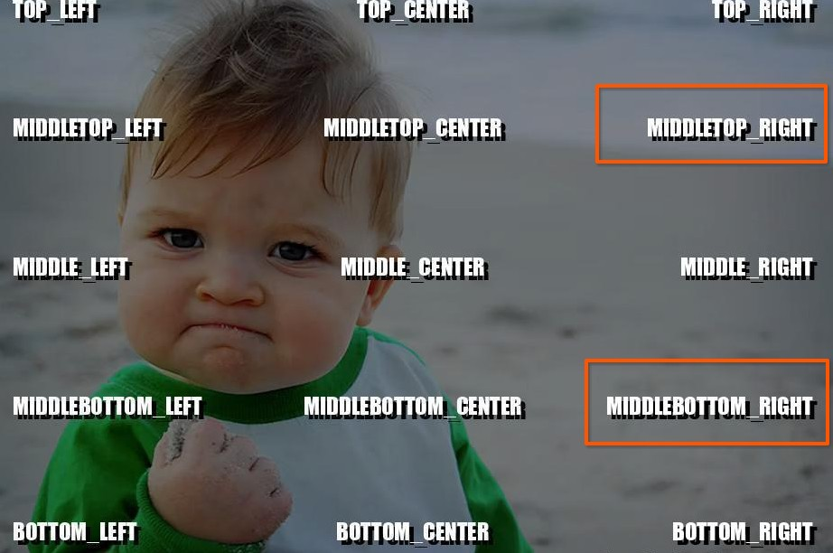
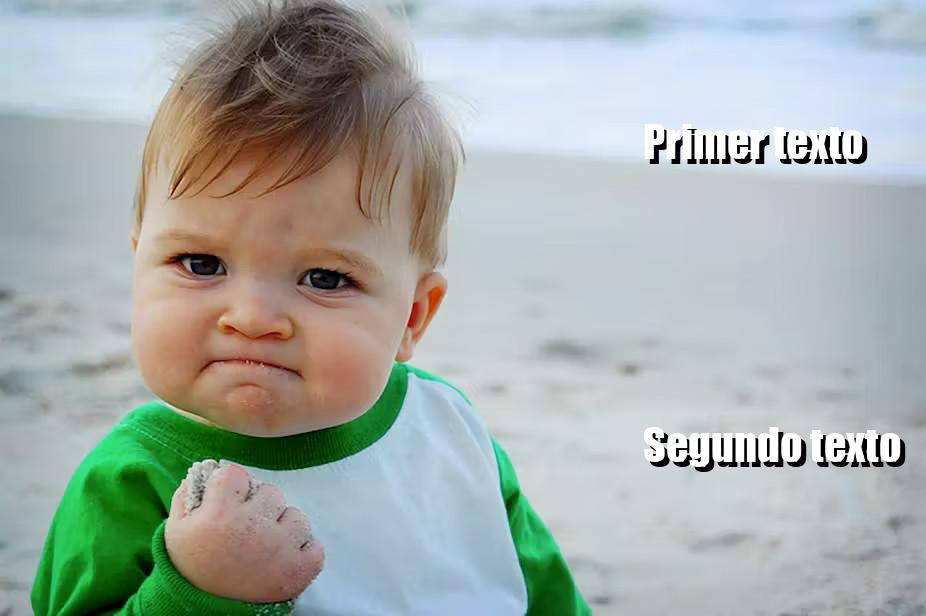

Pre-requisitos
--------------

Como primer paso es necesario instalar las dependencias:

.. code-block:: bash

    python -m venv env
    source env/bin/activate
    pip install -r src/requirements.txt

Modo de uso
-----------

La generación de memes se realiza mediante la clase :py:class:`Generator <src.generator.Generator>`,
la cual toma como parámetros principales la imagen a utilizar, el texto a insertar en esa imagen y la orientación del texto.

El texto a insertar puede estar definido hasta en dos partes (**first_text**, **second_text**),
para poder definir orientaciones independientes (**first_text_orientation**, **second_text_orientation**).:

Para el parámetro **input_image_path** podemos proveer tanto una ruta local como una url de la imagen a utilizar.

.. hint::

    En el directorio ``src/blank_images`` del proyecto disponemos de algunas imagenes para utilizar.

Tomando como ejemplo la siguiente imagen:

.. image:: ../../../src/blank_images/bebe.jpg
   :alt: Imagen de prueba
   :class: with-border with-shadow
   :align: center

|

Vamos a insertar dos textos, de acuerdo a las posiciones predeterminadas según la clase :py:class:`TextPosition <src.enums.TextPosition>`
tomaremos las posiciones **MIDDLETOP_RIGHT** y **MIDDLEBOTTOM_RIGHT**:

|

.. code-block:: python

    from src.generator import Generator
    from src.generator import TextPosition

    _generator = Generator()
    _generator.generate_meme(
        input_image_path = './src/blank_images/bebe.jpg',
        alias = 'test_meme',
        first_text = 'Primer texto',
        first_text_orientation = TextPosition.MIDDLETOP_RIGHT,
        second_text = 'Segundo texto',
        second_text_orientation = TextPosition.MIDDLEBOTTOM_RIGHT
    )

.. note::

    Si no definimos un valor para la constante ``FONT_SIZE``, el tamaño de la letra será un poco reducido
    si definimos los dos grupos de texto en lugar de uno.

|

Podemos ejecutar el archivo ``main.py`` para generar el o los memes de prueba:

.. code-block:: bash

    python ./src/main.py

Como resultado obtendremos la siguiente imagen:

